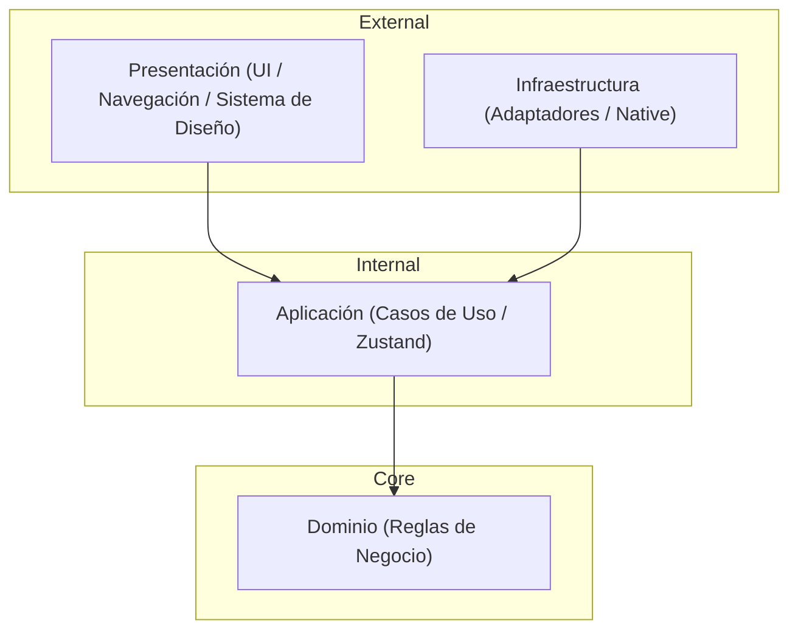
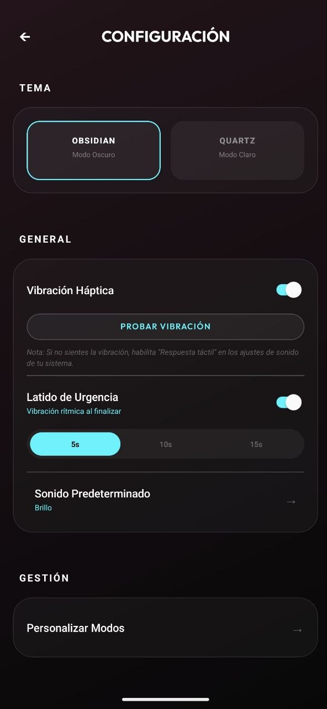
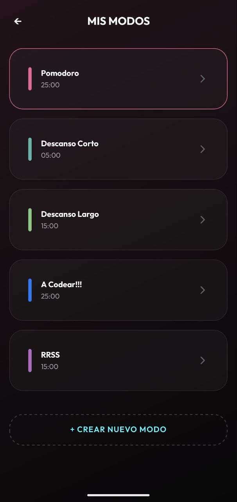
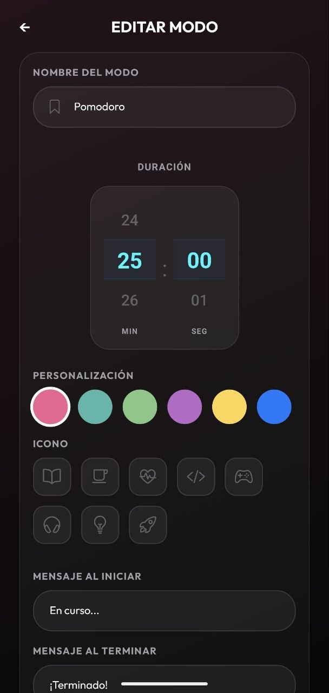

# Pomodoro

Esta es una aplicación de productividad basada en la técnica Pomodoro, diseñada para ayudarte a enfocarte en tus tareas dividiendo el tiempo en intervalos de trabajo seguidos de descansos cortos.

> [!IMPORTANT]
> **Compatibilidad:** Actualmente, esta aplicación está optimizada y probada **exclusivamente para Android**. Esto se debe al uso de módulos nativos personalizados en Kotlin y servicios de primer plano específicos de Android. No se garantiza el funcionamiento en iOS por el momento. Cualquier ayuda para adaptar y probar la aplicación en IOs será bienvenida.

[](https://github.com/robtk2/pomodoro/actions/workflows/verify.yml)
[](https://opensource.org/licenses/MIT)
[](#-calidad-y-testing)

---

## ✨ Características Principales

- **Temporizador de Alta Precisión**: Motor de tiempo basado en eventos nativos para evitar derivas comunes en JavaScript.
- **Servicio de Primer Plano (Android)**: El temporizador persiste incluso si la aplicación se cierra, gracias a un `Foreground Service` nativo en Kotlin.
- **Personalización Total**: Modos configurables (Trabajo, Descanso), selección de sonidos y feedback háptico.
- **Persistencia Local**: Estado guardado automáticamente mediante adaptadores asíncronos.

---

## 🏗️ Arquitectura Hexagonal

Este proyecto sigue los principios de **Clean Architecture** y **Arquitectura Hexagonal** para garantizar la mantenibilidad y testabilidad absoluta.



### Capas del Proyecto:

- **`src/domain`**: Contiene la lógica pura del temporizador, interfaces y entidades. Cero dependencias externas.
- **`src/application`**: Maneja el estado global con **Zustand**, ganchos de lógica y orquestación de casos de uso.
- **`src/infrastructure`**: Implementación de adaptadores para servicios nativos, persistencia (AsyncStorage) y servicios externos.
- **`src/presentation`**: Componentes visuales, pantallas, navegación y sistema de diseño.

---

## 🚀 Tecnologías

- **Expo (SDK 54)** & **React Native (0.81)**
- **TypeScript 6.0**: Tipado estricto en todo el codebase.
- **Kotlin**: Módulo nativo personalizado (`core-timer`) para precisión de sistema.
- **Zustand**: Gestión de estado ligera y eficiente.
- **React Navigation 7**: Navegación nativa moderna.
- **Jest & React Testing Library**: Pipeline de pruebas exhaustivo.

---

## 🛠️ Instalación y Desarrollo

### Prerrequisitos

- Node.js 22+
- Android Studio / Xcode (para compilación nativa)
- Expo Go o Development Build

### Pasos

1. Clonar el repositorio:
   ```bash
   git clone https://github.com/robtk2/pomodoro.git
   ```
2. Instalar dependencias:
   ```bash
   npm install
   ```
3. Iniciar en desarrollo:
   ```bash
   npm start
   ```

---

## 🧪 Calidad y Testing

El proyecto mantiene una de las coberturas de código más altas, garantizando que el motor de productividad sea infalible.

- **Linting**: `npm run lint`
- **Type Check**: `npm run type-check`
- **Tests**: `npm test`
- **Cobertura**: `npm test -- --coverage` (Actual: **99.68%**)

---

## 📸 Screenshots

|    Temporizador (Home)     |                    Notificación                     |              Configuración              |
| :------------------------: | :-------------------------------------------------: | :-------------------------------------: |
|  |  |  |

|               Listado de Modos               |          Edición de Modo           |
| :------------------------------------------: | :--------------------------------: |
|  |  |

---

## 📄 Licencia

Este proyecto está bajo la [Licencia MIT](LICENSE).

---

_Desarrollado con ❤️ para maximizar tu productividad._
